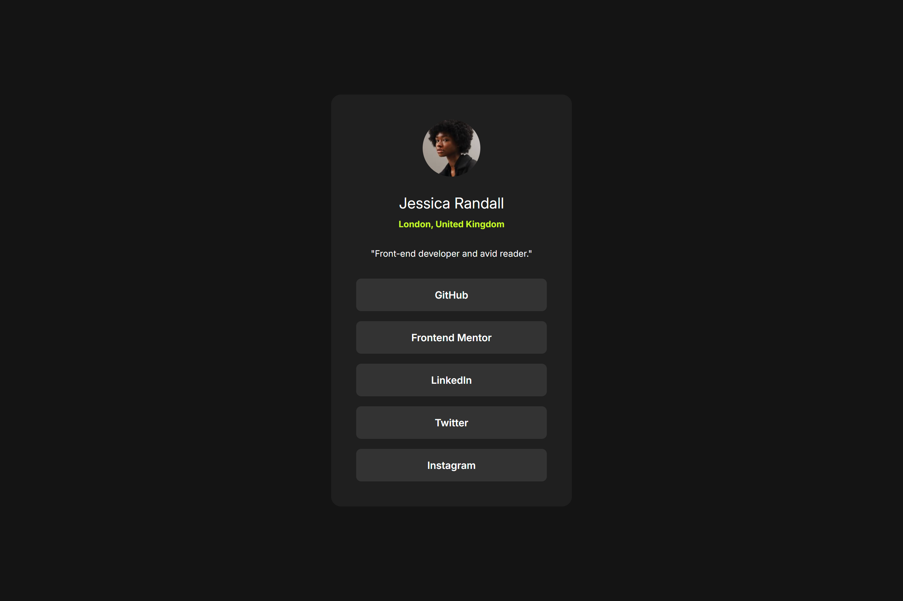
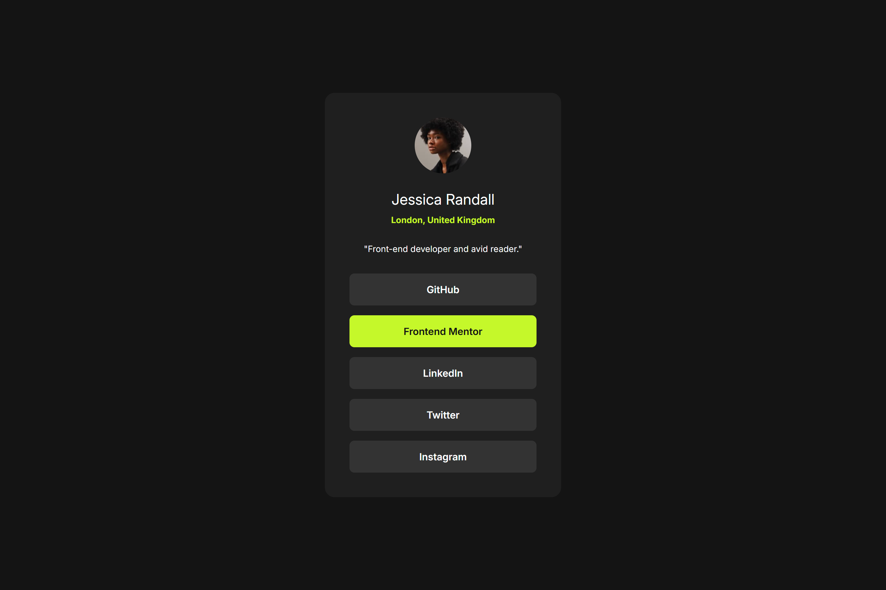
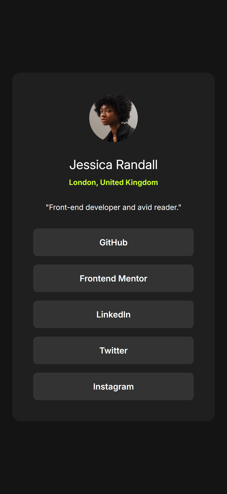
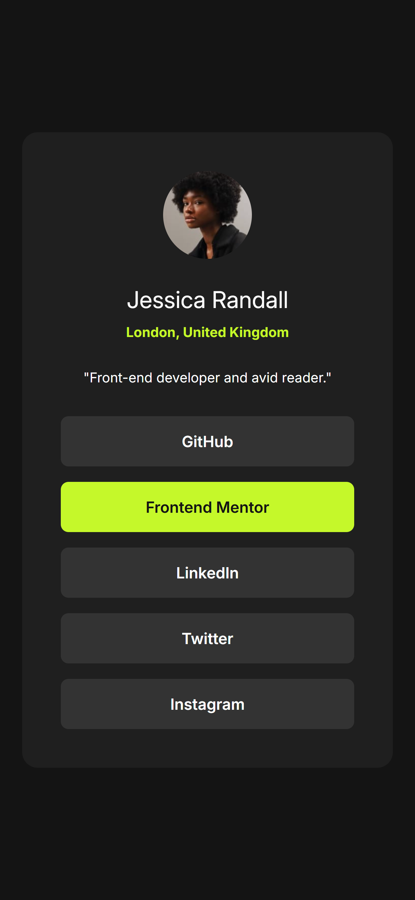

# Frontend Mentor - Blog preview card solution

This is a solution to the [Social links profile challenge on Frontend Mentor](https://www.frontendmentor.io/challenges/social-links-profile-UG32l9m6dQ). Frontend Mentor challenges help you improve your coding skills by building realistic projects.

## Table of contents

- [Overview](#overview)
  - [The challenge](#the-challenge)
  - [Screenshot](#screenshot)
  - [Links](#links)
- [My process](#my-process)
  - [Built with](#built-with)
  - [Useful resources](#useful-resources)
- [Author](#author)

## Overview

### The challenge

Users should be able to:

- See hover and focus states for all interactive elements on the page

### Screenshot

### Links

- Solution URL: [FrontendMentor solution page](https://www.frontendmentor.io/solutions/social-links-profile-solution-0ztmFQLVFe)
- Live Site URL: [GitHub Pages](https://edmarpaulino.github.io/frontend-mentor-social-links-profile-solution/)

## My process

### Built with

- Semantic HTML5 markup
- Sass
- Vite
- React
- TypeScript

### Useful resources

- [WCAG](https://www.w3.org/WAI/standards-guidelines/wcag/) - Help me with accessibility
- [Vite Static Deploy](https://vite.dev/guide/static-deploy) - Help me to deploy the project in GitHub Pages

## Author

- Frontend Mentor - [@edmarpaulino](https://www.frontendmentor.io/profile/edmarpaulino)
